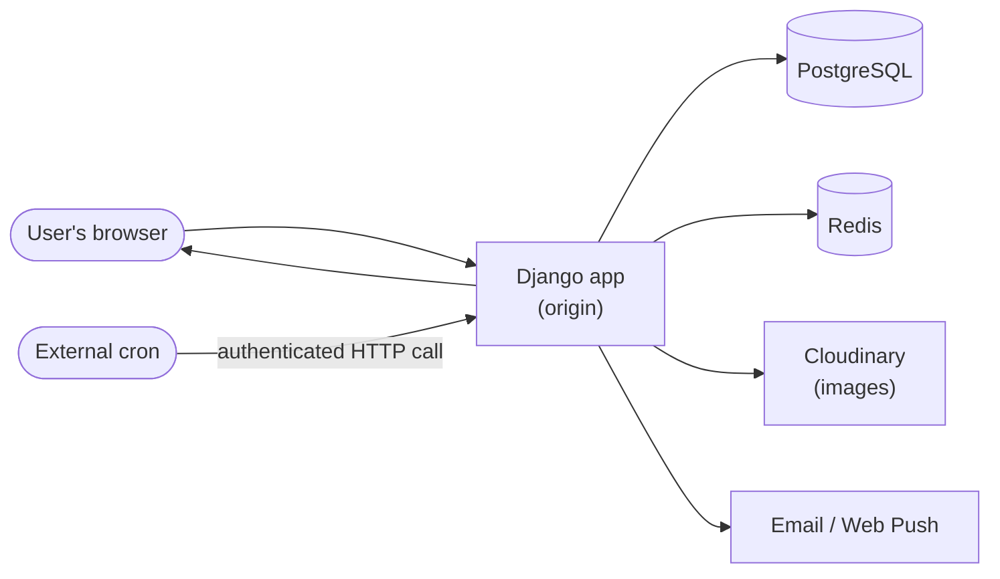
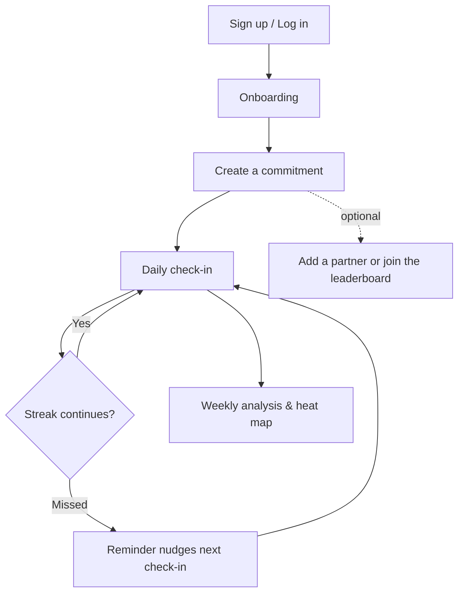

# Discipline & Streak

A Django-based habit and commitment tracker. Users create "commitments" (habits/goals), log daily entries, build streaks, track progress on a heat map, compete on a leaderboard, and can pair up with a partner or friends for accountability.

---

## Table of Contents

- [Overview](#overview)
- [Features](#features)
- [Tech Stack](#tech-stack)
- [How the App Fits Together](#how-the-app-fits-together)
- [User Journey](#user-journey)
- [Getting Started](#getting-started)
  - [Prerequisites](#prerequisites)
  - [Installation](#installation)
  - [Environment Variables](#environment-variables)
  - [Database & Static Files](#database--static-files)
  - [Running the App](#running-the-app)
- [Project Structure](#project-structure)
- [Background Jobs](#background-jobs)
- [License](#license)

---

## Overview

Discipline & Streak helps users stay consistent with their goals. Each user can define one or more **commitments**, check in daily, and watch their **streak** grow. Progress is visualized through a heat map and analytics reports, and users can opt into a **leaderboard** or pair with a **partner** for shared accountability.

## Features

- 🔐 Email/password authentication plus Google & Facebook social login
- ✅ Create, track, and archive personal commitments/habits
- 🔥 Daily check-ins with streak tracking and a GitHub-style heat map
- 📊 Weekly/analytical reports on progress
- 🏆 Opt-in leaderboard with weekly rankings
- 🤝 Friend requests and partner pairing for shared accountability
- 🔔 Web push notifications for check-in reminders
- 📰 In-app blog/news feed
- 🖼️ Profile customization (picture, theme, username) with Cloudinary-backed image storage
- 🛠️ Internal staff panel for user and content management
- 📤 Data export and account management (deactivation, reactivation, deletion)

## Tech Stack

| Layer            | Technology                                   |
|-------------------|-----------------------------------------------|
| Framework         | Django                                        |
| Database          | PostgreSQL                                    |
| Caching           | Redis (`django-redis`)                        |
| Auth              | Django auth + `social-auth-app-django` (Google, Facebook) |
| Static files      | WhiteNoise                                    |
| Media storage     | Cloudinary                                    |
| Email             | SMTP (Gmail) / Resend                         |
| Push notifications| Web Push (VAPID)                              |
| App server        | Gunicorn                                      |
| Load testing      | Locust                                        |

---

## How the App Fits Together

A high-level view of how a request flows through the system — intentionally at the component level, not a literal route map (see [Project Structure](#project-structure) for where things live in the codebase, and the in-app **Site Guide** for a navigable map of the product itself).



## User Journey

The core loop the product is built around:



Staff have a separate, access-code-gated flow for publishing blog posts and managing users/content — deliberately not detailed here since it isn't part of the regular user journey.

---

## Getting Started

### Prerequisites

- Python 3.x
- get in touch with me for others @ lastissa11@gmail.com

### Installation

```bash
git clone <repository-url>
cd DISCIPLINEandSTREAK
python -m venv .venv
source .venv/bin/activate   # Windows: .venv\Scripts\activate
pip install -r requirements.txt
```

### Environment Variables

Create a `.env` file in the project root:

```GET IN TOUCH WITH ME @LASTISSA11:GMAIL.COM FOR THE ENV SETUP
HIDDEN
```

### Database & Static Files

```GET IN TOUCH WITH ME @LASTISSA11:GMAIL.COM FOR THE DATABASE AND STATIC SETUP
HIDDEN
```

### Running the App

```bash
python manage.py runserver
```

The app will be available at `http://127.0.0.1:8000/`.

---

## Project Structure

```
DISCIPLINEandSTREAK/
├── DISCIPLINEandSTREAK/   # Project settings, root URLs, WSGI/ASGI entry points
├── origin/                # Main application (models, templates, static assets)
├── utility/                # Shared helpers (email, push notifications, reminders, config)
├── manage.py
├── requirements.txt       # The dependency my project use to function fully
└── runtime.txt            # For render hosting (additional information not important)
```

## Background Jobs

Reminder and maintenance jobs (e.g. check-in reminders) are triggered via authenticated HTTP calls from an external scheduler (cron), rather than an in-process worker - Reason because i cannot have a render background taska and i found a workaround

## License
MIT
